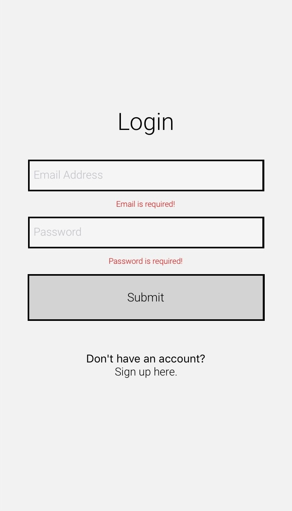
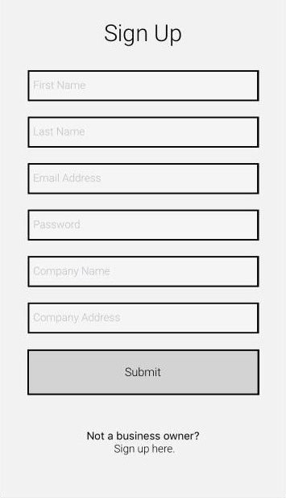
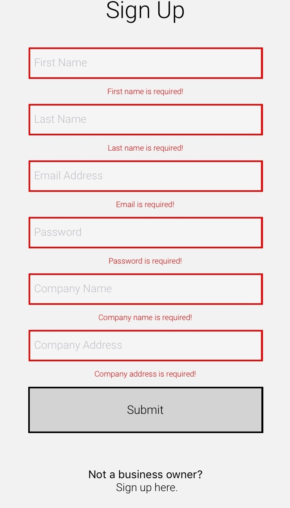

# B.O.S.S.

B.O.S.S. is a React Native application that is intended to help bridge the racial wealth gap and strengthen local economies. It provides consumers the ability to browse and search for black-owned businesses that they can support. Business owners can also add themselves and their businesses.

To run our application, go [here](https://expo.io/@teamhackerdelta/BOSS) and click 'Open project in the browser', or if you have an Android phone, scan our QR code to load the application immediately.

**_ The comments are not real or reflective of the businesses shown. They are simply there for demonstrative purposes. _**

## Features

- User authentication.
- Form validation.
- Users can comment on businesses.
- Users can remove their own comments and view comments.
- Users can view the profile of business owners.
- Users can filter businesses based on category type and/or location (through reverse geolocation).
- If a user attempts to write a comment and they are not logged in, they will be prompted to either log in or sign up.
- Users can have updated reviews like Yelp.

## Home Screen

## Login Screen

## User Sign Up Screen

## Owner Sign Up Screen

## Filter Options Screen

## Businesses Screen

## Business Screen

## Business Screen (Logged In)

## Prompt Screen

## Comment Form Screen

## Business Owner Screen

## Getting Started

These instructions will get you a copy of the project up and running on your local machine for development and testing purposes. See deployment for notes on how to deploy the project on a live system.

### Prerequisites

- You have installed the latest version of [Node.js](https://nodejs.org/en/) and [npm](https://www.npmjs.com).
- You have a Windows/Linux/Mac machine.

### Installing

To get acclimated, follow the steps below:

1. Fork and clone this repository.
2. Install [Expo CLI](https://docs.expo.io/get-started/installation/).
3. Run cd capstone and npm install or yarn install (depending on which package manager you have installed) to install the necessary packages.
4. Create a database called capstone and capstone-test.
5. Open a terminal and run npm run seed to seed the database.
6. Open a terminal and run npm run start to run the server and open another terminal to run npm run expo.

## Built With

- [React](https://reactjs.org) - The JavaScript library used for creating the user interfaces.
- [React Native](https://reactnative.dev) - The framework used to build applications using React.
- [Expo CLI](https://docs.expo.io) - The framework and platform that helps you develop, build, and deploy iOS, Android, and web applications by using the same JavaScript/TypeScript codebase.
- [Node.js](https://nodejs.org/en/) - The JavaScript runtime environment used to execute code.
- [npm](https://www.npmjs.com) - The package manager used to manage package dependencies.
- [Express](https://expressjs.com) - The JavaScript library used to handle HTTP requests.
- [Sequelize](https://sequelize.org) - A promise-based Node.js Object-relational mapping used with Postgres.
- [Axios](https://github.com/axios/axios) - The JavaScript library used to make HTTP requests.
- [ESlint](https://eslint.org) - The tool used to maintain code quality.
- [Prettier](https://prettier.io) - The tool used to format code.
- [React Navigation](https://reactnavigation.org) - The JavaScript library used for routing and navigation in React Native Applications.
- [React Native Paper](https://callstack.github.io/react-native-paper/) - The JavaScript library used to customize screens with production-ready components.
- [Heroku](https://www.heroku.com/) - The cloud platform used to host our Express server.
- [React Native Maps](https://github.com/react-native-community/react-native-maps) - The JavaScript library used to build maps and create markers.
- [React Native Snap Carousel](https://github.com/archriss/react-native-snap-carousel) - The JavaScript library used to create a carousel.
- [HERE Geocoding and Search](https://developer.here.com/products/geocoding-and-search) - The API used for reverse geocoding.

## Contributing

Please read [CONTRIBUTING.md](CONTRIBUTING.md) for details on our code of conduct, and the process for submitting pull requests to us.

## Versioning

We use [SemVer](http://semver.org/) for versioning. For the versions available, see the [tags on this repository](https://github.com/hackerDelta/capstone/tags).

## Authors

- **Courtney Edwards** - _Initial work_ - [courtneycodes95](https://github.com/courtneycodes95)
- **Hector Santana-Quintana** - _Initial work_ [sanquinluis](https://github.com/sanquinluis)
- **Nagi Sosa** - _Initial work_ [Nova-Nagi](https://github.com/Nova-Nagi)
- **Kristy Li** - _Initial work_ [ahtae](https://github.com/ahtae)

See also the list of [contributors](https://github.com/hackerDelta/capstone/graphs/contributors) who participated in this project.

## License

This project is licensed under the MIT License - see the [LICENSE.md](LICENSE.md) file for details

## Acknowledgments

- [Orlando Caraballo](https://github.com/orlandocaraballo/)
- [Stacey Eliuk](https://github.com/hotpinkpoliticalmatrix)
